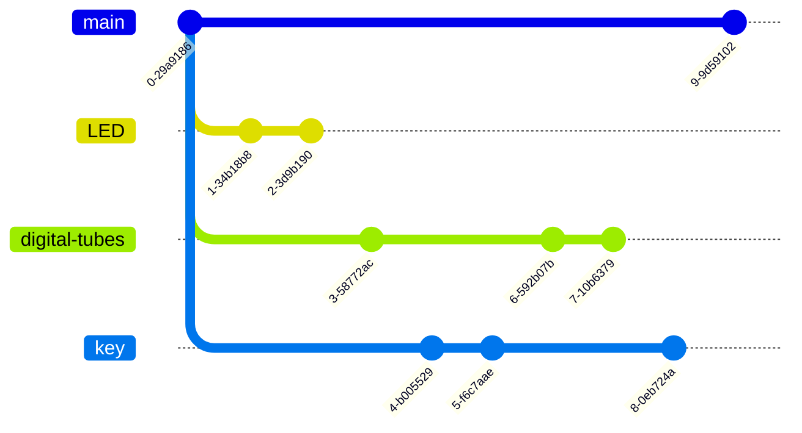

# C51 单片机的例程实验学习

准备信息：
- 参考教程：跟随 b 站尚硅谷的教程来重温 51 单片机。原理性学习准备跟哈工大的单片机原理，当然肯定得有空才去看，目前还是先熟练应用，找到工作要紧。
- 开发板：普中51-实验板
- 芯片型号：STC89 C 516 RD+ 40I - PDIP 40

### 仓库组织结构

一开始打算一直使用这一个仓库来记录所有例程实验，不兼容的例程放到不同分支，每个相关的例程系列都应给出一个最终版本。

这几天又重新学了下 git ，了解了分支模型和对象模型，感觉是不是得重建一个仓库了（笑）。准备让仓库的分支结构如下图：

每个分支如果结束了，就在最后的结束提交上打个标签，格式如：$branch-name finality。再考虑到不同的分支可能会调整 README 文件里的描述，但是每次修改又得 checkout main 才能修改，十分麻烦。所以考虑在每个分支里单独添加一个README.md，然后再回到初始提交里，给README添加分支的README文件记录。

应该还会添加一个 json 文件，通过 Project-Graph 软件来可视化编辑，主要描述一些学习过程中的想法，就不用 git 跟踪了，免得来回检出麻烦。

